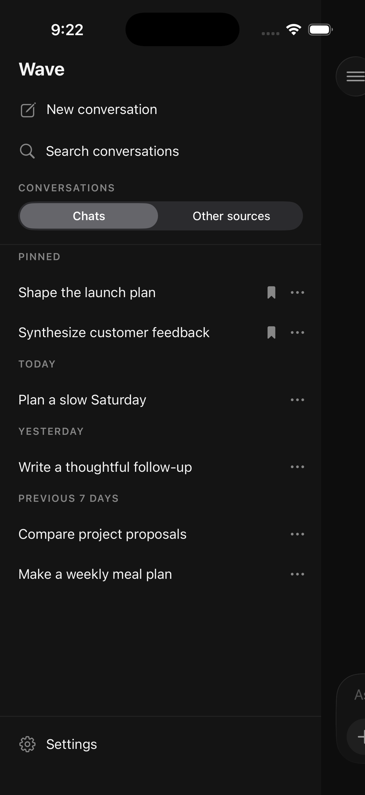
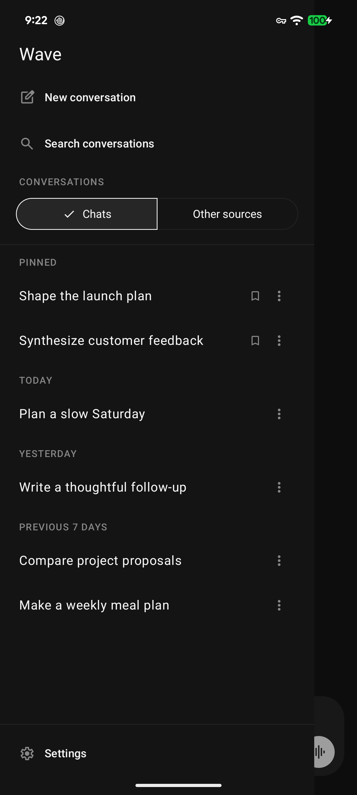
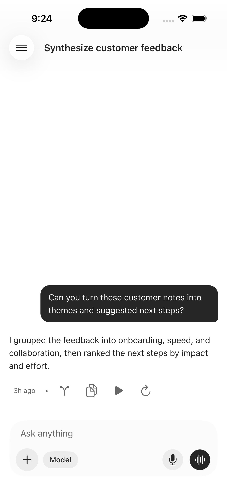
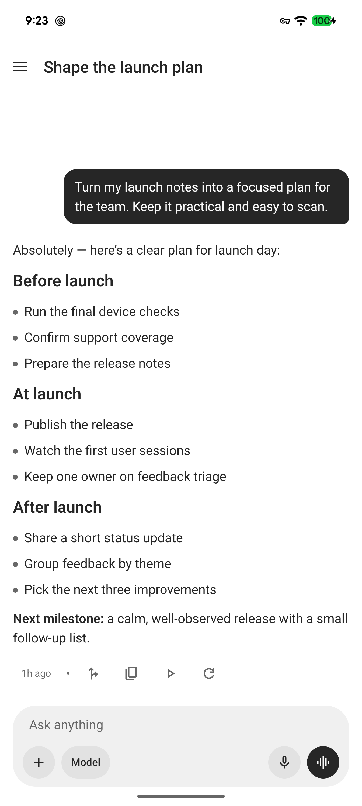

<p align="center">
  
</p>

<h1 align="center">Wave</h1>

<p align="center">
  A focused iOS and Android client for chatting naturally with your
  <a href="https://github.com/NousResearch/hermes-agent">Hermes Agent</a>.
</p>

<p align="center">
  
  
  <a href="./LICENSE"></a>
</p>

Wave is the conversation surface for a user's Hermes agent. It talks directly to the Hermes
gateway, keeps the product centered on chat and voice, and deliberately leaves server
administration to Hermes itself.

> [!IMPORTANT]
> Wave is under active development and does not yet publish store binaries. Text chat and gateway
> voice are functional, while Realtime voice still has release validation work tracked in the
> [roadmap](./docs/roadmap.md).

## Highlights

- Stream conversations from the Hermes gateway and resume work after disconnects or app restarts.
- Browse, search, pin, rename, delete, branch, and continue the account's top-level conversations.
- Send bounded images and text-based files, steer an active response, and answer inline Hermes
  prompts.
- Talk through Hermes's gateway speech endpoints with no additional client credential.
- Optionally use OpenAI Realtime for an interruptible live conversation that delegates substantial
  work to Hermes through narrow, validated tools.
- Choose the model for one conversation without exposing provider onboarding or global Hermes
  configuration.
- Read previously viewed conversations when the gateway is temporarily unavailable.
- Use native SwiftUI and Jetpack Compose controls where platform behavior matters, with PanelUI for
  shared React Native surfaces.

## Screenshots

<table>
  <thead>
    <tr>
      <th align="center">iOS</th>
      <th align="center">Android</th>
    </tr>
  </thead>
  <tbody>
    <tr>
      <td colspan="2" align="center"><strong>Browse conversations</strong></td>
    </tr>
    <tr>
      <td align="center"></td>
      <td align="center"></td>
    </tr>
    <tr>
      <td colspan="2" align="center"><strong>Continue a chat</strong></td>
    </tr>
    <tr>
      <td align="center"></td>
      <td align="center"></td>
    </tr>
  </tbody>
</table>

Screenshots use privacy-safe fixture conversations served by the repository's local test gateway.

## How it works

```text
Wave mobile ── rotating session tokens + gateway protocol ──> Hermes gateway
     │
     └════ direct WebRTC audio + sideband (user-owned key) ════> OpenAI Realtime API
```

Wave has no application backend of its own. Gateway sign-in is the only connection model, and the
Hermes API key never reaches the phone. If a user enables Realtime voice, their own OpenAI key is
validated before saving, stored only in device secure storage, and sent only to `api.openai.com`.

Realtime exposes two tightly scoped tools:

- `ask_hermes({ instruction })` delegates work to the conversation's trusted Hermes session.
- `correct_hermes({ instruction })` exists only while that delegated execution is active and can
  steer only that execution.

Arguments and responses are treated as untrusted data. Wave validates tool calls against explicit
schemas, preserves the user's intent and literal constraints, and reports completion only after
Hermes confirms it. See [Security](./docs/security.md) for the complete threat model and residual
risks.

## Product boundaries

Wave is intentionally a chat client, not a Hermes administration console. It does not manage
providers, credentials, global models, skills, server configuration, or infrastructure. Selecting
a model for one conversation is the narrow exception and remains session-scoped.

Wave supports iOS and Android only. React Native Web and server routes are out of scope.

## Tech stack

- [Expo SDK 57](https://docs.expo.dev/versions/v57.0.0/), React Native 0.86, and React 19.2
- [Expo Router](https://docs.expo.dev/versions/v57.0.0/router/introduction/) and `@expo/ui`
- [PanelUI](https://www.panelui.dev/docs), Uniwind, and Tailwind CSS v4
- TanStack Query for finite server state and focused controllers/reducers for active streams
- Zustand for versioned, device-local preferences only
- A runtime-neutral [`@wave/contracts`](./packages/contracts) workspace for normalized protocol
  schemas

## Getting started

### Requirements

- Node.js 24 LTS and npm
- Xcode for iOS development
- Android Studio for Android development
- A reachable Hermes gateway

Install dependencies and start the development Metro server:

```bash
nvm use
npm install
npm start
```

Wave uses native dependencies that are not present in a stock Expo Go installation. Build the
development client before first use and whenever native dependencies or app configuration change:

```bash
npm run prebuild:development
npm run run:development:ios
# or
npm run run:development:android -- --device
```

Sign in with the URL, username, and password used by the Hermes dashboard. Wave sends the password
only for sign-in and persists the gateway's rotating session tokens in platform secure storage.
Disconnect removes those local tokens; the gateway's stateless tokens cannot be individually
revoked.

See [Hermes connectivity](./docs/hermes-connectivity.md) for HTTPS requirements, private-network
development allowances, token rotation, and the normalized gateway contract.

### Build variants

`app.json` owns the production identity. The typed `app.config.ts` overlay gives local variants
distinct native identities so they can be installed side by side:

| Variant       | Display name     | Native identifier               | URL scheme     |
| ------------- | ---------------- | ------------------------------- | -------------- |
| `development` | `wave (Dev)`     | `com.renanqueiroz.wave.dev`     | `wave-dev`     |
| `preview`     | `wave (Preview)` | `com.renanqueiroz.wave.preview` | `wave-preview` |
| `production`  | `wave`           | `com.renanqueiroz.wave`         | `wave`         |

Development is the safe default for local Expo commands. The repository's EAS scripts are
deliberately local-only:

```bash
npm run build:preview:android:local
npm run build:production:android:local
npm run build:production:ios:local
```

Generated native projects and build outputs are ignored. Do not commit signing credentials or
local artifacts.

## Development tools

The repository includes two focused test systems:

- [`tools/voice-harness`](./tools/voice-harness/README.md) provides a deterministic fake Hermes
  gateway and scripted OpenAI Realtime peer for end-to-end chat and voice tests.
- [`tools/mobile-agent`](./tools/mobile-agent/README.md) provides device discovery, accessibility
  inspection, screenshots, gestures, logs, and production-bundle smoke tests.

Development builds also expose local WebRTC and streaming-PCM proofs under **Settings →
Development**. Their contracts and validation records live in
[WebRTC foundation](./docs/webrtc-foundation.md) and
[PCM playback foundation](./docs/pcm-playback-foundation.md).

## Validation

Run the repository checks before handing off a change:

```bash
npm run build:contracts
npm test
npm run lint
npm run typecheck
npm run verify:boundaries
npx expo install --check
npx expo-doctor
npm run mobile:smoke:production
```

The production smoke test exports both platforms and rejects credential-shaped literals in shipped
JavaScript bundles. The [dependency review](./docs/dependency-security.md) records current
SDK-compatibility and audit decisions.

## Contributing

Contributions are welcome. Read the [contributor guide](./CONTRIBUTING.md) and the product and
architecture constraints in [AGENTS.md](./AGENTS.md) before starting a change. Report suspected
vulnerabilities privately through the [security policy](./SECURITY.md), not in a public issue.

## Repository map

```text
src/app/              Expo Router routes and layouts
src/features/         Product behavior and feature-owned UI
src/services/gateway/ Raw Hermes protocol boundary and normalization
src/services/realtime OpenAI Realtime transport and orchestration
src/state/             Device-local preference state
packages/contracts/   Runtime-neutral Wave schemas
tools/                 Deterministic gateway and mobile test tooling
docs/                  Architecture, security, and validation records
```

Shared UI uses PanelUI semantic tokens. Settings, Connect, the chat composer, and the voice
screens keep explicit platform-native SwiftUI and Jetpack Compose implementations behind shared
behavior contracts. Read
[AGENTS.md](./AGENTS.md) before changing architecture or product boundaries.

## Documentation

- [Architecture and workspace boundaries](./docs/architecture.md)
- [Security model](./docs/security.md)
- [Vulnerability reporting policy](./SECURITY.md)
- [Contributor guide](./CONTRIBUTING.md)
- [Hermes gateway contract](./docs/hermes-connectivity.md)
- [Roadmap](./docs/roadmap.md)
- [Dependency and supply-chain review](./docs/dependency-security.md)
- [WebRTC foundation](./docs/webrtc-foundation.md)
- [Streaming PCM playback foundation](./docs/pcm-playback-foundation.md)

## License

Wave is available under the [MIT License](./LICENSE). The license preserves the notices for
retained Expo starter material and the official Expo skills committed in this repository.
Third-party native dependencies keep their own licenses; installed builds expose generated
acknowledgements under **Settings → Legal → Open-source licenses**.
